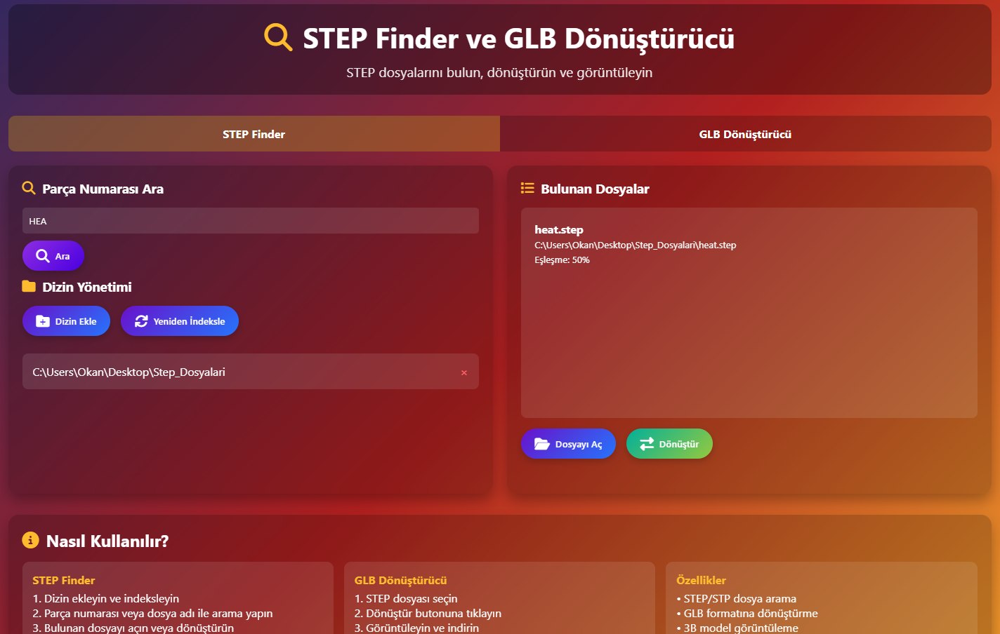
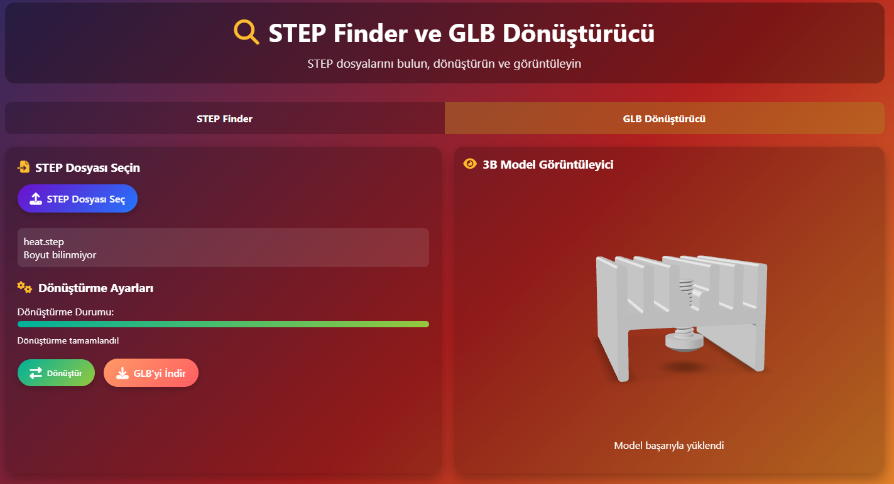

# STEP Finder & GLB Converter

A comprehensive tool for finding STEP files, converting them to GLB format, and viewing them in 3D.


---

## 🚀 Features

- 🔍 **STEP File Search**: Find STEP/STP files by part number or filename  
- 🔄 **GLB Conversion**: Convert STEP/STP files to GLB format  
- 👁️ **3D Viewing**: View converted models interactively  
- 📁 **Directory Management**: Add and manage multiple directories  
- 🎨 **Modern Interface**: User-friendly and responsive web interface  

---

## ⚙️ Installation

### Requirements

- Python **3.8+**
- `pip` (Python package manager)

### Installation Steps

Clone the repository:
```bash
git clone https://github.com/username/step-finder-glb-converter.git
cd step-finder-glb-converter
```

Install required packages:
```bash
pip install flask trimesh flask-cors
```

Run the application:
```bash
python app.py
```

Open your browser and navigate to:  
👉 [http://localhost:5000](http://localhost:5000)

---

## 🖥️ Usage

### STEP Finder

1. **Add Directory**: Click "Add Directory" button and enter the path containing STEP files  
2. **Indexing**: Use "Re-index" to scan files  
3. **Search**: Enter part number or filename  
4. **Actions**: Open files or convert to GLB  

### GLB Converter

1. **Select File**: Use "Select STEP File" to upload a file  
2. **Convert**: Click "Convert" button  
3. **View**: Model is automatically displayed  
4. **Download**: Save using "Download GLB" button  

---

## 📡 API Endpoints

| Method | Endpoint              | Description |
|--------|----------------------|-------------|
| GET    | `/`                  | Main application interface |
| POST   | `/upload`            | Upload STEP file |
| POST   | `/convert`           | Convert STEP → GLB |
| GET    | `/download/<filename>` | Download GLB file |
| GET    | `/view/<filename>`   | View GLB file |
| POST   | `/search`            | Search STEP files |
| POST   | `/add_directory`     | Add directory |
| GET    | `/get_directories`   | List added directories |
| POST   | `/remove_directory`  | Remove directory |
| POST   | `/reindex`           | Re-index files |

---

## 📂 File Structure

```text
step-finder-glb-converter/
│
├── app.py                 # Main Flask application
├── index.json             # Indexed file information
├── uploads/               # Uploaded STEP files
├── converted/             # Converted GLB files
└── README.md              # This file
```

---

## 🤝 Contributing

1. Fork the project  
2. Create your feature branch (`git checkout -b feature/AmazingFeature`)  
3. Commit your changes (`git commit -m 'Add some AmazingFeature'`)  
4. Push to the branch (`git push origin feature/AmazingFeature`)  
5. Open a Pull Request  

---

## 📜 License

This project is licensed under the **MIT** License. See the `LICENSE` file for details.  

---

## 📧 Contact

- Project Owner: **OKAN KOCER**  
- Project Link: [GitHub Repository](https://github.com/oknkcr/STEP_FINDER)  

---

## 📸 Screenshots

   
  

---

## ❓ FAQ

**Q: I'm getting errors when adding a directory, what should I do?**  
A: Make sure you enter the correct directory path. Example: `C:\Users\Username\Desktop\STEP_Files`  

**Q: The conversion process is failing, what could be the reason?**  
A: The file might be corrupted or the application may have insufficient permissions.  

**Q: Can I convert large files?**  
A: Yes, files up to 50MB are supported. Processing may take longer for larger files.  

**Q: Which STEP/STP versions are supported?**  
A: Most common versions are supported, but not all variations are guaranteed.  

---

⭐️ If you find this project useful, don't forget to give it a star!
